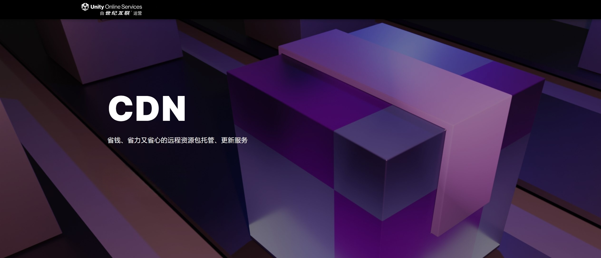

# UOS CDN

### 什么是 UOS CDN？

UOS CDN 是 **Unity** 官方推出的基于CDN的内容管理系统，可以帮助开发者轻松部署和管理远程资源包。

官方主页：https://uos.unity.cn/document/cdn

### 如何接入YooAsset?

了解Unity官方提供的文档：https://uos.unity.cn/document/cdn#yooasset
