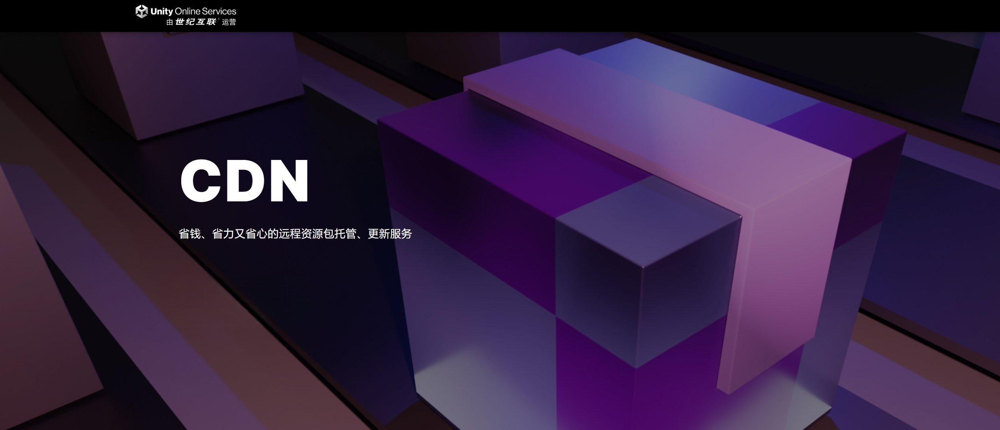

# UOS CDN

### What is UOS CDN?

UOS CDN is a content management system based on CDN, officially launched by **Unity**, which helps developers easily deploy and manage remote asset packages.

Official website: https://uos.unity.cn/document/cdn

### How to integrate YooAsset?

Refer to the official documentation provided by Unity: https://uos.unity.cn/document/cdn#yooasset
