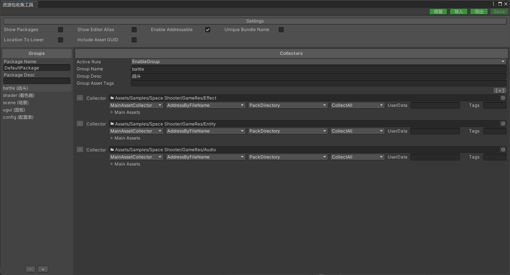

# Resource Configuration

Learn about the resource configuration interface.



### Interface Introduction

The left side is the group list, and the right side is the configuration interface for that group.

Import button: Allows you to import a saved XML file.

Export button: Allows you to export the configuration data as an XML file.

Fix button: After moving the folder in the configuration, you can use this button to fix it.

**Note**: This tool only supports Unity 2019.4+.

### Common Settings

- Show Packages

  Whether to display the resource package list view.

- Show Editor Alias

  Whether to display in Chinese mode.

- Enable Addressable

  Enable the addressable resource localization system.

- Unique Bundle Name

  Append the package name as a prefix to the resource package name.

- Location To Lower

  Resource location address is case-insensitive.

- Include Asset GUID

  Include resource GUID information in the manifest.

### Resource Groups

- Active Rule

  Activate rules, rules can be customized and extended. The following are built-in rules:

  - EnableGroup: Enable the group.

  - DisableGroup: Disable the group.

  ````csharp
  //自定义扩展范例
  public class DisableGroup : IActiveRule
  {
      public bool IsActiveGroup()
      {
          return false;
      }
  }
  ````

- Grouper Name

  分组名称

- Grouper Desc

  分组备注信息

- Asset Tags

  资源分类标签列表，该分组下收集的资源会全部被打上该标签。

  注意：多个标签用分号隔开，例如 level1;level2;level3

### 搜集器

- **Collect Path**

  收集路径，可以指定文件夹或单个资源文件。

- **Collector Type**

  收集器类型：

  - MainAssetCollector 收集参与打包的主资源对象，并写入到资源清单的资源列表里（可以通过代码加载）。
  - StaticAssetCollector 收集参与打包的主资源对象，但不写入到资源清单的资源列表里（无法通过代码加载）。
  - DependAssetCollector 收集参与打包的依赖资源对象，但不写入到资源清单的资源列表里（无法通过代码加载）（当依赖资源没有被任何主资源引用的时候，则会在打包的时候自动剔除）。
  
  StaticAssetCollector收集器和DependAssetCollector收集器适合对资源进行定制化打包策略。
  
  示例1：一个游戏的粒子特效的纹理会非常多，通常特效制作师会把这些纹理放到一个文件夹内管理。如果我们把这些纹理打进一个AssetBundle文件内，当下次更新的时候，如果新增或改动了一个纹理，那么就要上传整个纹理的AssetBundle文件。我们可以把特效纹理通过DependAssetCollector收集器进行收集并自定义打包规则，通过文件名称的首字母进行小粒度打包，这样一个AssetBundle文件会被拆分为26个AssetBundle文件。
  
  示例2：当我们需要严格控制某个文件夹内的依赖资源打进同一个AssetBundle文件内，那么StaticAssetCollector收集器是最佳选择，该收集器收集的资源，无论是否被其它资源引用或被多个资源引用，这些资源都会按照设定的打包规则打包，且这些资源不会被处理为share资源包。
  
- **AddressRule**

  可寻址规则，规则可以自定义扩展。下面是内置规则：

  - AddressByFileName 以文件名为定位地址。
  - AddressByFilePath 以文件路径为定位地址。
  - AddressByGrouperAndFileName 以分组名+文件名为定位地址。
  - AddressByFolderAndFileName 以文件夹名+文件名为定位地址。
  
  ````csharp
  //自定义扩展范例
  public class AddressByFileName : IAddressRule
  {
      string IAddressRule.GetAssetAddress(AddressRuleData data)
      {
          return Path.GetFileNameWithoutExtension(data.AssetPath);
      }
  }
  ````
  
- **PackRule**

  打包规则，规则可以自定义扩展。下面是内置规则：

  - PackSeparately 以文件路径作为资源包名，每个资源文件单独打包。
  - PackDirectory 以文件所在的文件夹路径作为资源包名，该文件夹下所有文件打进一个资源包。
  - PackTopDirectory 以收集器下顶级文件夹为资源包名，该文件夹下所有文件打进一个资源包。
  - PackCollector 以收集器路径作为资源包名，收集的所有文件打进一个资源包。
  - PackGroup 以分组名称作为资源包名，收集的所有文件打进一个资源包。
  - PackRawFile 目录下的资源文件会被处理为原生资源包。

  ````csharp
  //自定义扩展范例
  public class PackDirectory : IPackRule
  {
      PackRuleResult IPackRule.GetPackRuleResult(PackRuleData data)
      {
          //"Assets/Config/test.txt" --> "Assets/Config"
          string bundleName = Path.GetDirectoryName(data.AssetPath);
          PackRuleResult result = new PackRuleResult(bundleName, DefaultPackRule.AssetBundleFileExtension);
          return result;   
      }
      bool IPackRule.IsRawFilePackRule()
      {
          return false;
      }
  }
  ````

- **FilterRule**

  过滤规则，规则可以自定义扩展。下面是内置规则：

  - CollectAll 收集目录下的所有资源文件
  - CollectScene 只收集目录下的场景文件
  - CollectPrefab 只收集目录下的预制体文件
  - CollectSprite 只收集目录下的精灵类型的文件

  ````csharp
  //自定义扩展范例
  public class CollectScene : IFilterRule
  {
      public bool IsCollectAsset(FilterRuleData data)
      {
          return Path.GetExtension(data.AssetPath) == ".unity";
      }
  }
  ````

- **UserData**

  用户自定义数据，可以帮助定制化AddressRule和PackRule。
  
- **AssetTags**

  资源分类标签列表，该收集器下收集的资源会全部被打上该标签。

### 代码示例

开发者可以通过访问收集器的实例类实现自定义需求。

例如：下面示例是通过代码关闭某个Group

```csharp
using YooAsset.Editor;

private void SetGroupDisable(string packageName, string groupName)
{
    foreach (var package in AssetBundleCollectorSettingData.Setting.Packages)
    {
        if (package.PackageName == packageName)
        {
            foreach (var group in package.Groups)
            {
                if (group.GroupName == groupName)
                {
                    group.ActiveRuleName = nameof(DisableGroup);
                    break;
                }
            }
        }
    }
}
```
