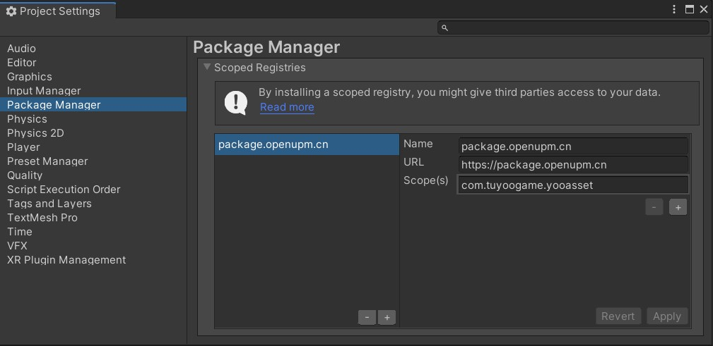
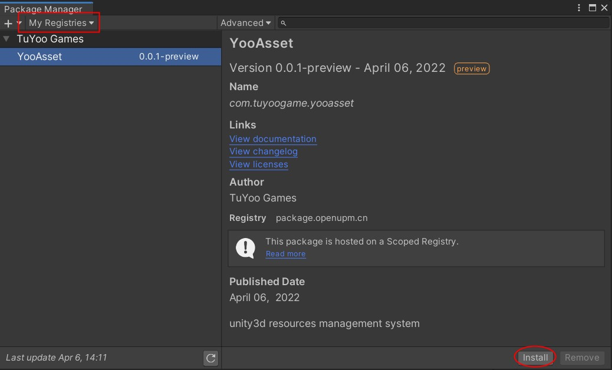

# Quick Start

Learn about the quick installation methods.

### Download and Install

1. **Install via PackageManager**

   Open the management interface **Edit/Project Settings/Package Manager**

   ````
   // 输入以下内容（中国版）
   Name: package.openupm.cn
   URL: https://package.openupm.cn
   Scope(s): com.tuyoogame.yooasset
   ````

   ```
   // 输入以下内容（国际版）
   Name: package.openupm.com
   URL: https://package.openupm.com
   Scope(s): com.tuyoogame.yooasset
   ```

   

   打开管理界面 **Edit/Windows/Package Manager**

   

2. **通过Packages清单安装**

   直接修改Packages文件夹下的清单文件manifest.json

   ````json
   {
     "dependencies": {
       "com.tuyoogame.yooasset": "0.0.1-preview",
       ......
     },
     "scopedRegistries": [
       {
         "name": "package.openupm.cn",
         "url": "https://package.openupm.cn",
         "scopes": [
           "com.tuyoogame.yooasset"
         ]
       }
     ]
   }
   ````

3. **通过Github下载安装**

   在发布的Release版本中，选择最新版本下载Source Code压缩包。

### 系统需求

支持版本: Unity2019.4 & Unity2020.3 & Unity2021.3 & Unity2022.3

支持平台: Windows、OSX、Android、iOS、WebGL

开发环境: .NET4.x

### 目录结构

````
Assets
└─ YooAsset
    ├─ Editor - Editor source code directory
    ├─ Runtime - Runtime source code directory
    ├─ LICENSE - License document
    └─ README - Readme document
````

