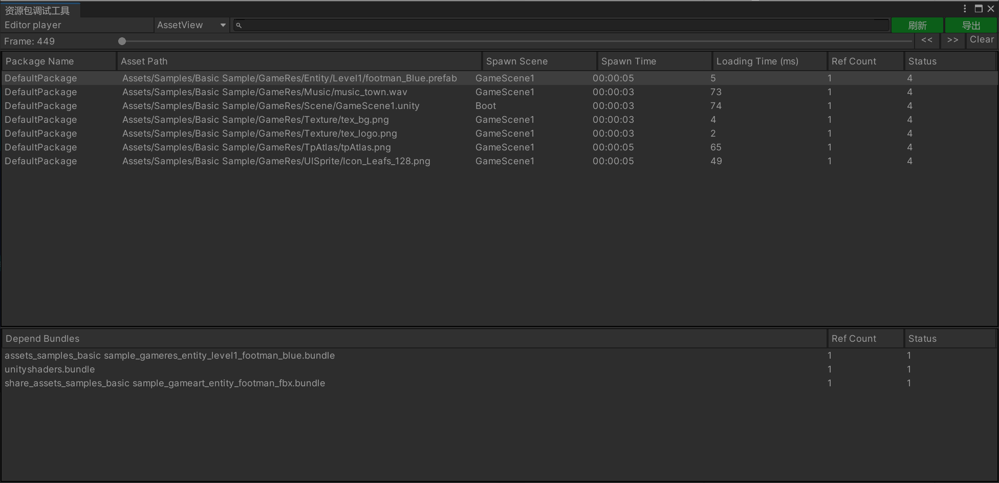
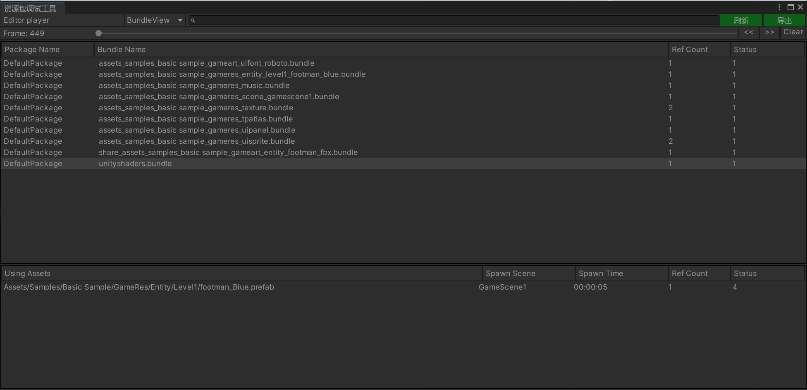

# Debugger

Learn how to use the runtime debugger.

The debugger is a tool that helps us view resource loading information during game runtime. It can be used to identify potential resource leaks.

You can view information about resource objects (AssetView) and resource bundles (BundleView).

**Note**: This tool is only supported in Unity 2019.4+.

### Considerations for Remote Debugging on Mobile Devices

When building the package, make sure to check "Development Build" and "Autoconnect Profiler".

### Resource Object List View

### Resource Bundle List View

