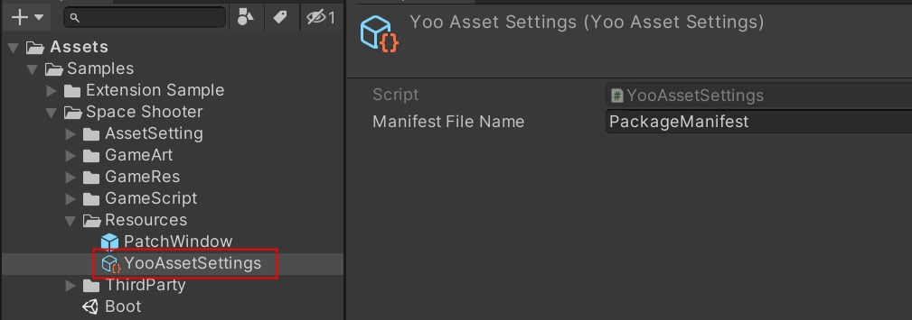

# Global Configuration

Learn about the global configuration file.

Create a configuration file by right-clicking (Right-click inside the Project window -> Create -> YooAsset -> Create Setting)

**Note**: Please place the configuration file in the Resources folder.

Configuration details:

- **Manifest File Name**: Name of the manifest file
