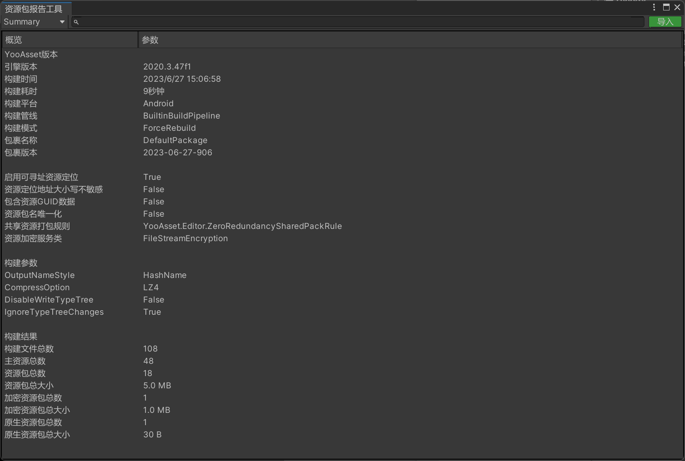
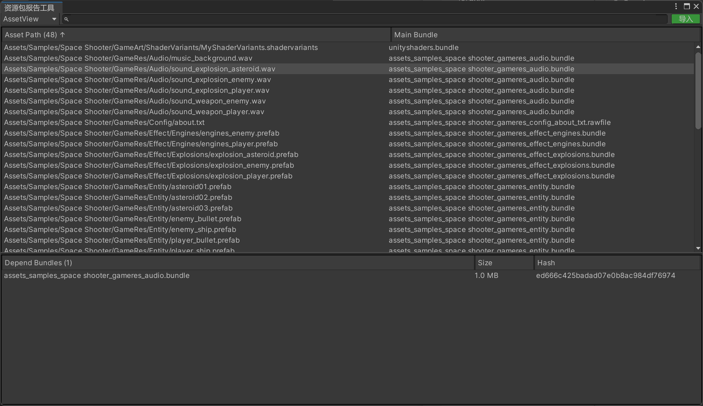
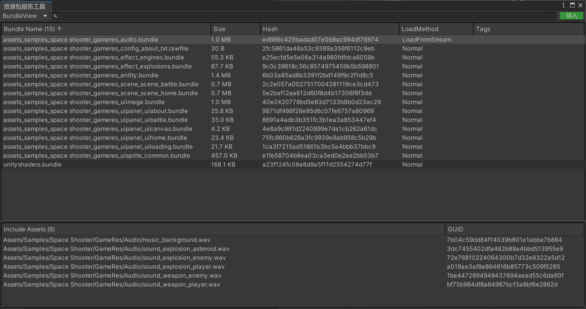
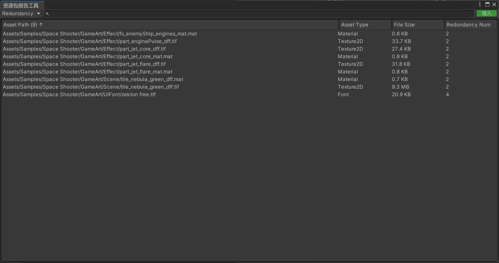

# Build Report

Learn how to view the build report for resources.

The report tool allows you to view the summary information, resource object view, resource package view, and redundant resource view.

**Note**: This tool only supports Unity 2019.4+.

### Summary View

### Resource Object List View

You can view the list of resource objects and the resource packages that each resource object depends on.

### Resource Package List View

You can view the list of resource packages and the resource objects contained in each resource package.

### Redundant Resource List View

Developers can control redundancy rules by implementing their own ISharedPackRule class. This view allows you to observe the redundancy information of resources.

