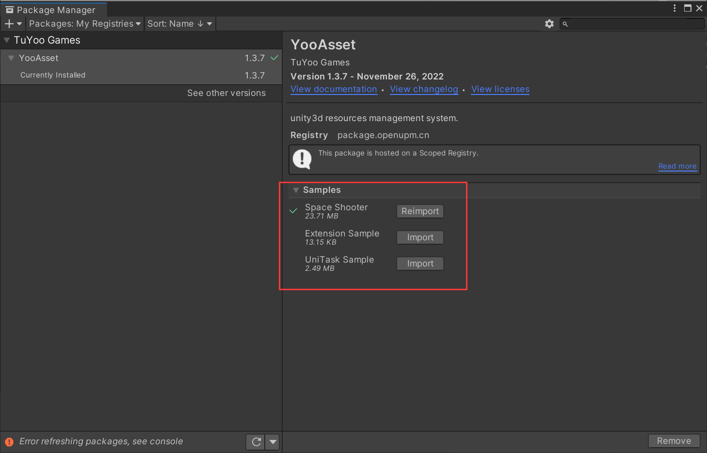

# Example Tutorial

This tutorial explains how to import example projects.

#### Example Content

**Space Shooter** is a demo of a space shooter game that includes examples of resource hot-reloading and loading.

**Extension Sample** contains examples of editor extension code.

**UniTask Sample** contains examples of code that supports UniTask.

#### Import Process Precautions

1. After importing Space Shooter, open YooAsset->AssetBundle Collector window.
2. Click the Fix button, then click the Save button to save the configuration, and finally close the window.
3. Find the Boot.scene scene to start the game.
