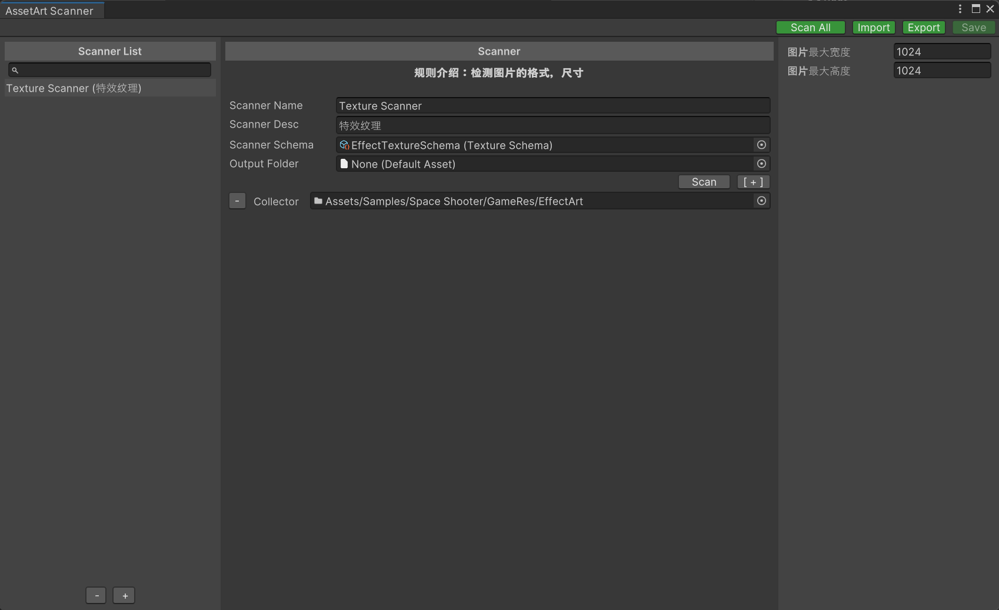

# 资产扫描器

学习资产扫描配置界面和扩展自定义资产扫描器。



### 工具介绍

左侧为资产扫描器列表，中间为扫描器的配置界面，最右侧为扫描器的参数检视界面。

导入按钮：可以导入保存的XML文件。

导出按钮：可以将配置数据导出为XML文件。

扫描所有按钮：执行扫描列表里的所有扫描器，并输出各自的报告。

**注意**：该工具仅支持Unity2019.4+

### 扫描器配置

- Scanner Name

  扫描器名称。

- Scanner Desc

  扫描器备注信息。

- Scanner Schema

  扫描器的模式文件。

- Output Folder

  报告文件的输出目录。

- Collector

  配置需要扫描的目录。

### 扫描器检视界面

开发者在实现自定义扫描器时，可以编写专属的参数检视界面。

### 扫描器接口扩展

继承基类ScannerSchema并实现虚拟方法。ScannerSchema实际上是可序列化类型。

太空战机DEMO里实现了一个非常简单的[纹理扫描器](https://github.com/tuyoogame/YooAsset/blob/dev/Assets/YooAsset/Samples~/Space%20Shooter/GameScript/Editor/TextureSchema.cs)，可以直接阅读源码来快速学习。

```csharp
public abstract class ScannerSchema : ScriptableObject
{
    /// <summary>
    /// 获取用户指南信息
    /// </summary>
    public abstract string GetUserGuide();

    /// <summary>
    /// 运行生成扫描报告
    /// </summary>
    public abstract ScanReport RunScanner(AssetArtScanner scanner);

    /// <summary>
    /// 修复扫描结果
    /// </summary>
    public abstract void FixResult(List<ReportElement> fixList);

    /// <summary>
    /// 创建检视面板
    /// </summary>
    public virtual SchemaInspector CreateInspector()；
}
```

