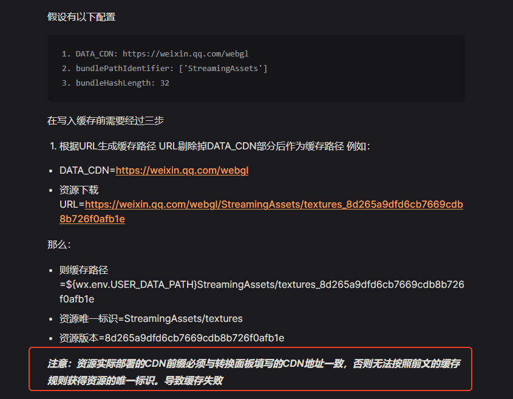

# 小游戏方案

了解一些常规的解决方案。

### 微信小游戏

首先安装WX-WASM-SDK-V2 Unity插件，然后导入微信文件系统相关代码，WebPlayMode初始化的时候使用微信文件系统类。

微信文件系统相关代码可以在扩展工程内找到：Extension Sample --> Runtime --> WechatFileSystem

微信文件系统注意事项：

1. 不支持同步加载。
2. 不支持资源加密。
3. 不支持原生文件构建管线。

原生文件解决办法：

1. 修改Unity引擎无法识别的文件的后缀名为.bytes。
2. 视频文件通过微信插件来加载播放，视频文件不做资源版本控制。

需要关注的代码段：

````csharp
class WechatFileSystem : IFileSystem
{
    // 微信缓存根目录是否需要调整?
    public virtual void OnCreate(string packageName, string rootDirectory)
    {
        PackageName = packageName;
        
        _wxFileSystemMgr = WX.GetFileSystemManager();
        _fileCacheRoot = $"{WX.env.USER_DATA_PATH}/__GAME_FILE_CACHE";
        //_fileCacheRoot = $"{WX.env.USER_DATA_PATH}/__GAME_FILE_CACHE/子目录"; //注意：如果有子目录，请修改此处！
        //_fileCacheRoot = PathUtility.Combine(WX.PluginCachePath, $"StreamingAssets/WebGL");
    }
    
    // 保证该方法返回正确的查询结果
    public virtual bool Exists(PackageBundle bundle)
    {
        string filePath = GetWXFileLoadPath(bundle);
        string result = _wxFileSystemMgr.AccessSync(filePath);
        return result.Equals("access:ok");
    }
}
````

**注意**：一定要禁止微信对资源清单版本文件进行缓存（文件名称样例：PackageManifest_xxx.version）

**注意**：URL地址里不要包含双反斜杠，例如：www.cdn.com/v1.0/android//xxx.bundle，双反斜杠会导致微信插件加载文件失败，但网络请求又不返回失败！

微信小游戏的配置教程：https://www.bilibili.com/read/cv24995199/

微信小游戏插件官方文档：https://wechat-miniprogram.github.io/minigame-unity-webgl-transform/Design/FileCache.html



### 抖音小游戏

首先安装字节小游戏相关的Unity插件，然后导入抖音文件系统相关代码，WebPlayMode初始化的时候使用抖音文件系统类。

抖音文件系统相关代码可以在扩展工程内找到：Extension Sample --> Runtime --> ByteGameFileSystem

抖音文件系统注意事项：

1. 不支持同步加载。
2. 不支持资源加密。
3. 不支持原生文件构建管线。

原生文件解决办法：

1. 修改Unity引擎无法识别的文件的后缀名为.bytes。
2. 视频文件通过抖音插件来加载播放，视频文件不做资源版本控制。

需要关注的代码段：

````csharp
class ByteGameFileSystem : IFileSystem
{
    public virtual void OnCreate(string packageName, string rootDirectory)
    {
        PackageName = packageName;
        _fileSystemManager = StarkSDK.API.GetStarkFileSystemManager();
    }
    
    // 保证该方法返回正确的查询结果
    public virtual bool Exists(PackageBundle bundle)
    {
        string filePath = GetCacheFileLoadPath(bundle);
        return _fileSystemManager.AccessSync(filePath);
    }
}
````


