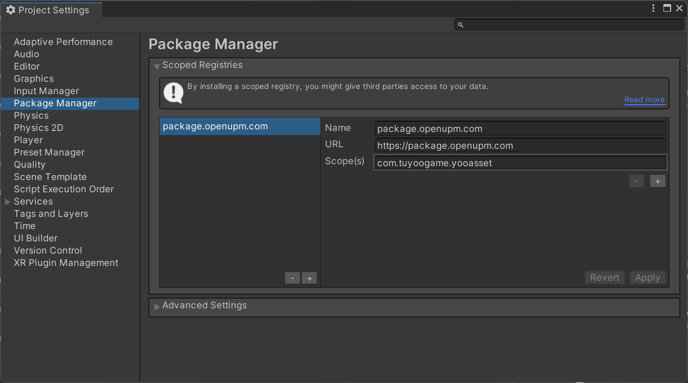
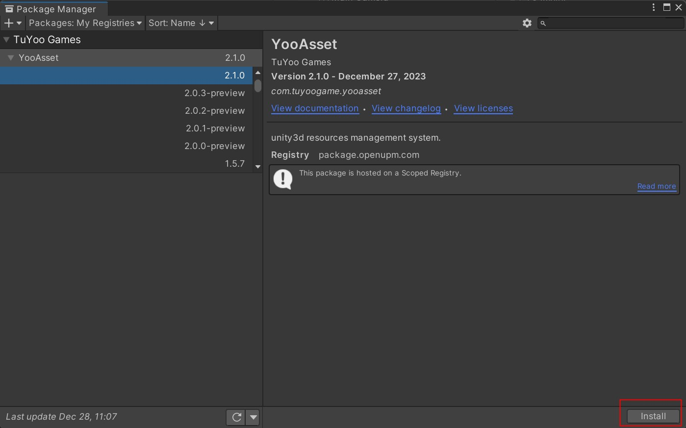

# 快速开始

了解快捷安装方法。

### 下载安装

1. **通过PackageManager安装**

   打开管理界面 **Edit/Project Settings/Package Manager**

   ```
   // 输入以下内容（国际版）
   Name: package.openupm.com
   URL: https://package.openupm.com
   Scope(s): com.tuyoogame.yooasset
   ```

   
   
   打开管理界面 **Edit/Windows/Package Manager**
   
   
   
2. **通过Packages清单安装**

   直接修改Packages文件夹下的清单文件manifest.json

   ````json
   {
     "dependencies": {
       "com.tuyoogame.yooasset": "2.x.x",
       ......
     },
     "scopedRegistries": [
       {
         "name": "package.openupm.com",
         "url": "https://package.openupm.com",
         "scopes": [
           "com.tuyoogame.yooasset"
         ]
       }
     ]
   }
   ````

3. **通过Github下载安装**

   在发布的Release版本中，选择最新版本下载Source Code压缩包。

### 系统需求

支持版本: Unity2019.4 & Unity2020.3 & Unity2021.3 & Unity2022.3 & Unity6.0

支持平台: Windows、OSX、Android、iOS、WebGL

开发环境: .NET4.x

### 目录结构

````
Assets
└─ YooAsset
    ├─ Editor 编辑器源码目录
    ├─ Runtime 运行时源码目录
    ├─ LICENSE 版权文档
    └─ README 说明文档
````

