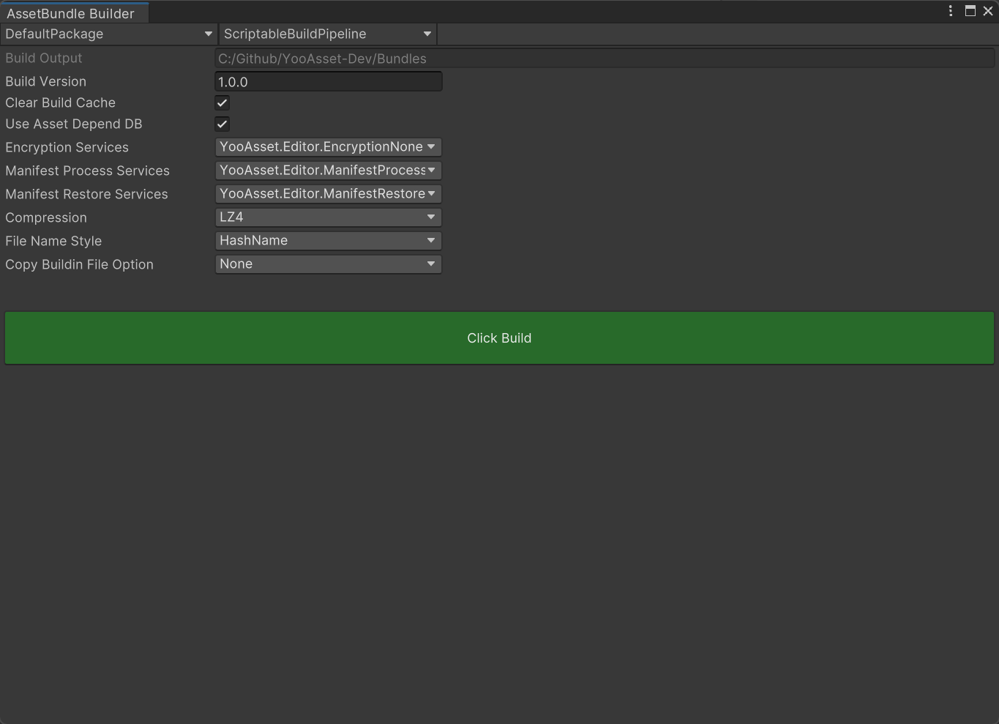

# 资源构建

学习资源构建界面。



### 界面介绍

- **Build  Package**

  资源包裹的列表，下拉选择要构建的资源包裹。

- **Build Pipeline**

  构建管线的列表，下拉选择要使用的构建管线。

  (1) EditorSimulateBuildPipeline: 编辑器下模拟构建管线

  ​	会生成资源清单文件，但不会生成Bundle文件，用于编辑器下模拟真实打包环境。

  (1) BuiltinBuildPipeline: 内置构建管线

  (2) ScriptableBuildPipeline: 可编程构建管线

  ​	Unity后续推出的可编程构建管线，和可编程渲染管线一样，让开发者有能力控制打包流程。

  ​	**注意：**从Unity2021.3版本开始，推荐使用该构建管线！

  (3) RawFileBuildPipeline: 原生文件构建管线

  ​	用于构建Unity引擎无法识别的资源类型，例如FMOD的音频文件(bank后缀格式)

- **Build Output**

  构建输出的目录，会根据Unity编辑器当前切换的平台自动划分构建结果。

- **Build Version**

  构建的资源包版本。

- **Clear Build Cache**

  清理构建缓存，将会重新构建所有资源包。

  <u>当不勾选此项的时候，引擎会开启增量打包模式，会极大提高构建速度！</u>
  
- **Use Asset Depend DB**

  在资源收集过程中，使用资源依赖关系数据库。

  <u>当开启此项的时候，会极大提高构建速度！</u>

- **Encryption Services**

  资源包加密类列表。

- **Manifest Process Services**

  资源清单加密或压缩类列表。

- **Manifest Restore Services**

  资源清单解密或解压类列表。

- **Compression**

  资源包的压缩方式。

- **File Name Style**

  输出的资源包文件名称样式

  HashName：哈希值

  BundleName: 资源包名

  BundleName_HashName：资源包名+哈希值

 - **Copy Buildin File Option**

   首包资源文件的拷贝方式

   (1) None：不拷贝任何文件

   (2) ClearAndCopyAll：先清空已有文件，然后拷贝所有文件

   (3) ClearAndCopyByTags：先清空已有文件，然后按照资源标签拷贝文件

   (4) OnlyCopyAll：不清空已有文件，直接拷贝所有文件

   (5) OnlyCopyByTags：不清空已有文件，直接按照资源标签拷贝文件

- **构建**

  点击构建按钮会开始构建流程，构建流程分为多个节点顺序执行，如果某个节点发生错误，会导致构建失败。错误信息可以在控制台查看。

### 资源文件加密

在Editor目录下实现一个继承IEncryptionServices接口的类。

构建页面选择资源加密服务类。

加密支持三种方式：

- LoadFromFileOffset 通过文件偏移来解密加载。
- LoadFromMemory 通过文件内存来解密加载。
- LoadFromStream 通过文件流来解密加载。

参考：[示例代码](https://github.com/tuyoogame/YooAsset/tree/dev/Assets/YooAsset/Samples~/Test%20Sample/Runtime/CryptoSample)

### 资源清单加密

在Editor目录下实现一个继承IManifestServices接口的类。

构建页面选择清单加密服务类和清单解密服务类。

参考：[示例代码](https://github.com/tuyoogame/YooAsset/tree/dev/Assets/YooAsset/Samples~/Test%20Sample/Runtime/CryptoSample)

### 补丁包

构建成功后会在输出目录下找到补丁包文件夹，该文件夹名称为本次构建时指定的资源版本号。

补丁包文件夹里包含资源清单文件，资源包文件，构建报告等。


### 资源清单

- DefaultPackage.version

  资源版本文件

- DefaultPackage_xxx.hash

  记录了资源清单文件的哈希值。

- DefaultPackage_xxx.json

  该文件为Json文本格式，主要用于开发者预览信息。

- DefaultPackage_xxx.bytes

  该文件为二进制格式，主要用于程序内读取加载。

### 构建报告

- DefaultPackage_xxx.report

  构建报告文件。可以通过构建报告窗口查看本次构建的详细信息。

### 版本比对

当构建完成后需要将差异化内容上传到CDN服务器，可以参考[示例代码](https://github.com/tuyoogame/YooAsset/tree/dev/Assets/YooAsset/Samples~/Extension%20Sample/Editor/PackageComparator)编写差异化比对工具。

### 构建错误码

参考[构建管线错误码](./008-BuildPipelineErrorCode.md)页面。

### Jenkins支持

如果需要自动化构建，可以参考如下代码范例：

下面是使用内置构建管线来构建资源包的代码。

注意：可编程构建管线可以参考[源码](https://github.com/tuyoogame/YooAsset/tree/dev/Assets/YooAsset/Editor/AssetBundleBuilder/VisualViewers/ScriptableBuildPipeline);

````csharp
private static void BuildInternal(BuildTarget buildTarget)
{
    Debug.Log($"开始构建 : {buildTarget}");

    var buildoutputRoot = AssetBundleBuilderHelper.GetDefaultBuildOutputRoot();
    var streamingAssetsRoot = AssetBundleBuilderHelper.GetStreamingAssetsRoot();
    
    // 构建参数
    BuiltinBuildParameters buildParameters = new BuiltinBuildParameters();
    buildParameters.BuildOutputRoot = buildoutputRoot;
    buildParameters.BuildinFileRoot = streamingAssetsRoot;
    buildParameters.BuildPipeline = EBuildPipeline.BuiltinBuildPipeline.ToString();
    buildParameters.BuildBundleType = (int)EBuildBundleType.AssetBundle; //必须指定资源包类型
    buildParameters.BuildTarget = BuildTarget;
    buildParameters.PackageName = "DefaultPackage";
    buildParameters.PackageVersion = "1.0";
    buildParameters.VerifyBuildingResult = true;
    buildParameters.EnableSharePackRule = true; //启用共享资源构建模式，兼容1.5x版本
    buildParameters.FileNameStyle = EFileNameStyle.HashName;
    buildParameters.BuildinFileCopyOption = EBuildinFileCopyOption.None;
    buildParameters.BuildinFileCopyParams = string.Empty;
    buildParameters.EncryptionServices = CreateEncryptionInstance();
    buildParameters.CompressOption = ECompressOption.LZ4;
    buildParameters.ClearBuildCacheFiles = false; //不清理构建缓存，启用增量构建，可以提高打包速度！
    buildParameters.UseAssetDependencyDB = true; //使用资源依赖关系数据库，可以提高打包速度！
    
    // 执行构建
    BuiltinBuildPipeline pipeline = new BuiltinBuildPipeline();
    var buildResult = pipeline.Run(buildParameters, true);
    if (buildResult.Success)
    {
         Debug.Log($"构建成功 : {buildResult.OutputPackageDirectory}");
    }
    else
    {
        Debug.LogError($"构建失败 : {buildResult.ErrorInfo}");
    }
}

// 从构建命令里获取参数示例
private static string GetBuildPackageName()
{
    foreach (string arg in System.Environment.GetCommandLineArgs())
    {
        if (arg.StartsWith("buildPackage"))
            return arg.Split("="[0])[1];
    }
    return string.Empty;
}
````

### 注意事项

#### SBP构建管线注意事项

如果自行编码构建逻辑，请务必设置内置着色器资源包名称，且和自动收集的着色器资源包名保持一致！

```csharp
private static void BuildInternal(BuildTarget buildTarget)
{
    // 构建参数
    ScriptableBuildParameters buildParameters = new ScriptableBuildParameters();
    ......
    buildParameters.BuiltinShadersBundleName = GetBuiltinShaderBundleName();
}

/// <summary>
/// 内置着色器资源包名称
/// 注意：和自动收集的着色器资源包名保持一致！
/// </summary>
private string GetBuiltinShaderBundleName()
{
    var uniqueBundleName = AssetBundleCollectorSettingData.Setting.UniqueBundleName;
    var packRuleResult = DefaultPackRule.CreateShadersPackRuleResult();
    return packRuleResult.GetBundleName(PackageName, uniqueBundleName);
}
```

#### 内置资源自行处理注意事项

如果自行编码或手动拷贝资源包文件到StreamingAssets目录下，请遵循默认规则。

默认规则如下：StreamingAssets/yoo/PackageName/内置资产

1. 构建APP的时候自动处理

​	需要导入脚本到项目内：Samples/Extension Sample/Editor/PreprocessBuild（[示例代码](https://github.com/tuyoogame/YooAsset/tree/dev/Assets/YooAsset/Samples~/Extension%20Sample/Editor/PreprocessBuild)）

2. 手动人工生成

   需要导入脚本到项目内：Samples/Extension Sample/Editor/CreateBuildinCatalog（[示例代码](https://github.com/tuyoogame/YooAsset/tree/dev/Assets/YooAsset/Samples~/Extension%20Sample/Editor/CreateBuildinCatalog)）

### 重要概念

- **增量构建**

  增量构建是在Unity的帮助下实现的一种快速打包机制。主要是利用资源构建相关的缓存文件来避免二次构建，以此来提高打包效率。

- **首包资源**

  在构建应用程序的时候，我们希望将某些资源打进首包里，首包资源拷贝至StreamingAssets/yoo/目录下。首包资源如果发生变化，也可以通过热更新来更新资源。

- **补丁包**

  无论是通过增量构建还是强制构建，在构建完成后都会生成一个以包裹版本（PackageVersion）命名的文件夹，我们把这个文件夹统称为补丁包。补丁包里包含了游戏运行需要的所有资源，我们可以无脑的将补丁包内容覆盖到CDN目录下，也可以通过编写差异分析工具，来筛选出和线上最新版本之间的差异文件，然后将差异文件上传到CDN目录里。
  
- **Catalog文件**

  如果通过YOO的构建页面打包，并配置了CopyBuildinFileOption导入内置文件，会通过TaskCreateCatalog任务节点自动生成Catalog文件。

  Catalog文件记录了资源包裹在StreamingAssets目录下的内置文件查询列表，它是默认的内置文件系统（DefaultBuildinFileSystem）依赖的关键文件。

  如果自行编码或手动拷贝资源包文件到StreamingAssets目录下，需要在触发构建APP前自动生成Catalog文件，请参考上方的注意事项里的解决方案。

  

  
