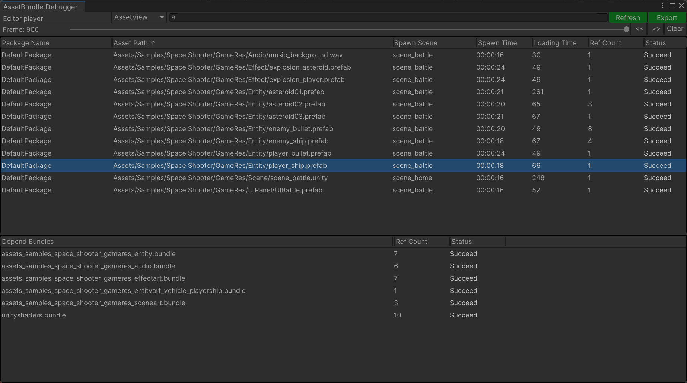
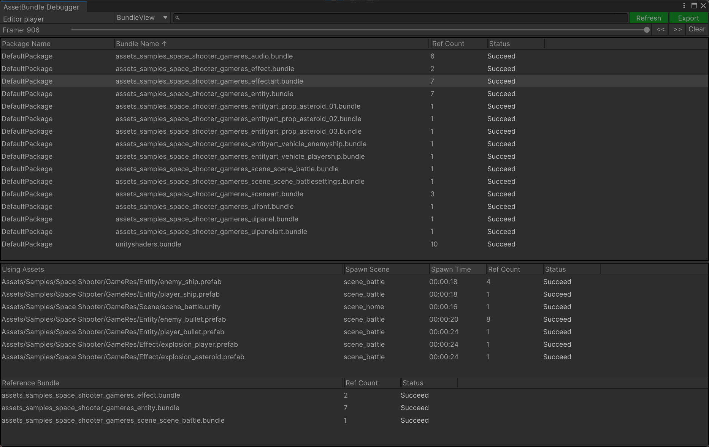

# 调试器

学习如何使用运行时的调试器。

调试器是在游戏运行时，帮助我们查看资源包加载信息的工具，通过该工具可以发现潜在的资源泄漏。

可以查看资源对象列表信息（AssetView），资源包列表信息（BundleView）。

**注意**：该工具仅支持Unity2019.4+

**安卓平台**：Unity2020, Unity2021版本直接支持，Unity2019版本需要借助ADB命令

```
adb forward tcp:34999 localabstract:Unity- 包名
```

### 真机远程调试注意事项

在构建安装包的时候，需要勾选上Development Build和Autoconnect Profiler

### 资源对象列表视图

该页面展示了当前加载的所有资源对象，以及加载耗时，加载状态，引用计数等数据。

Depend Bundles 是选中的资源对象加载所依赖的资源包列表！



### 资源包列表视图

该页面展示了当前加载的所有资源包，以及加载状态，引用计数等数据。

Using Asset 是选中的资源包当前正在使用的资源对象列表。

Reference Bundle 是选中的资源包相关引用关系的资源包列表（谁引用了选中的资源包）。

当一个资源包在内存里被卸载需要2个条件：

1. Using Assets 列表里所有资源对象的引用计数为零。
2. Reference Bundle 列表里所有资源包的引用计数为零。



