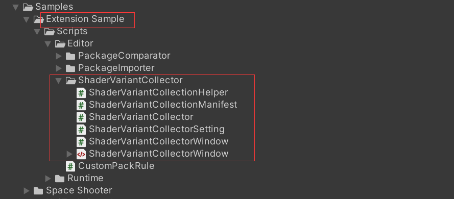
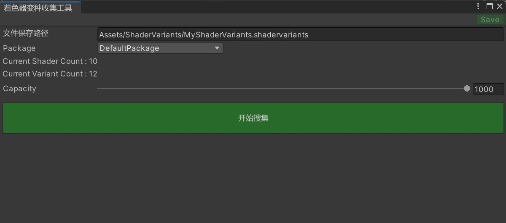

# 着色器变种收集

学习如何进行着色器变种的收集。

着色器变种收集方式有很多，YooAsset提供了一个简单暴力的收集方案，该方案不一定是最优方案（仅供参考）

### 工具获取

可以通过Package Manager来导入扩展工程。



### 工具介绍

菜单栏Tools ---> 变种着色器收集器



点击搜集变种按钮开始收集，请耐心等待结束。

**注意：在收集完成之后，需要将生成的shadervariants文件配置到收集界面（AssetBundle Collector）。**

### Jenkins支持

```csharp
public static void CollectSVC()
{
    string savePath = ShaderVariantCollectorSettingData.Setting.SavePath;  
    System.Action completedCallback = () =>
    {
        ShaderVariantCollection collection =
            AssetDatabase.LoadAssetAtPath<ShaderVariantCollection>(savePath);
        if (collection != null)
        {
            Debug.Log($"ShaderCount : {collection.shaderCount}");
            Debug.Log($"VariantCount : {collection.variantCount}");
        }
        else
        {
            throw new Exception("Failed to Collect shader Variants.");
        }
        
        EditorTools.CloseUnityGameWindow();
        EditorApplication.Exit(0);
    };
    ShaderVariantCollector.Run(savePath, completedCallback);
}
```

```csharp
// 命令行调用
%Projects_UnityEngine_Path% -batchmode -projectPath %Projects_UnityProject_Path% -executeMethod ET.CIHelper.CollectSVC -logFile %Projects_UnityProject_Path%/Logs/CIBuildSVC.log
```

**注意：**命令行里不要添加 -quit，上面的执行脚本在完成任务后，会自动退出编辑器。
