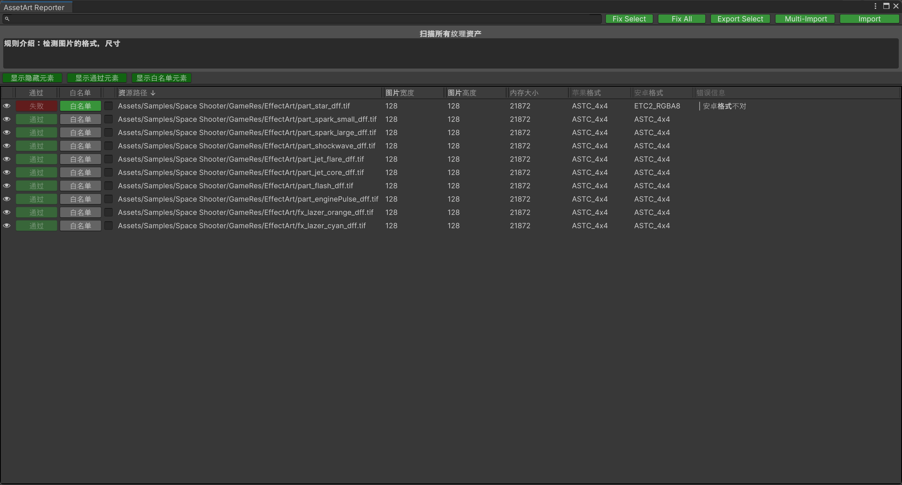

# 资产扫描报告

学习如何查看资产扫描报告。



### 工具介绍

导入按钮（Import）：可以导入单个报告文件。

导入按钮（Multi-Import）：可以同时导入多个报告文件并合并显示（**注意**：扫描器必须一致）。

导出选择按钮（Export Select）：导出所有勾选的元素关联的资源文件（文件拷贝）。

修复所有按钮（Fix All）：修复所有未通过元素（排除白名单和隐藏元素）。

修复选择按钮（Fix Select）：修复所有勾选的元素（包含白名单和隐藏元素）。

显示隐藏元素：显示隐藏元素（眼睛开关控制显隐）。

显示通过元素：显示通过元素。

显示白名单元素：显示白名单元素。

**注意**：该工具仅支持Unity2019.4+

### 搜索栏支持

- 通用关键字搜索

  例如：输入某个资源的文件名称，会自动过滤。

- 指定项的关键字搜索

  例如：搜索“错误信息”项的内容，可以输入以下命令。

  注意：中间冒号为小写。左侧为指定项，右侧为关键字。

  ```cmd
  错误信息:安卓格式不对
  ```

- 指定项的数值比较搜索

  例如：比较“内存大小”项的数值，可以输入以下命令。

  注意：中间为比较符号。左侧为指定项，右侧为比较数值。

  ```cmd
  内存大小=1024
  图片宽度>1024
  图片宽度>=1024
  图片高度<1024
  图片高度<=1024
  ```
