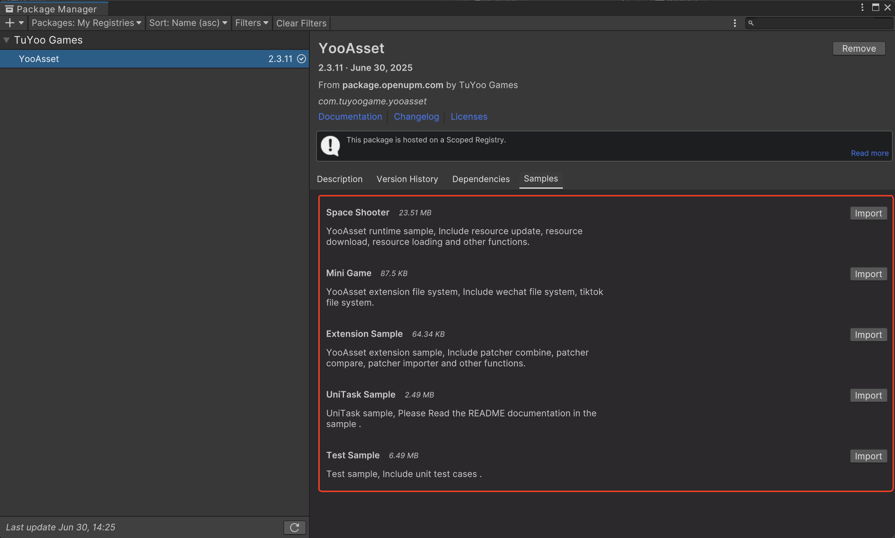

# 示例教程

介绍如何导入示例工程。

#### 示例内容

**Space Shooter** 太空战机DEMO，包含完整资源热更流程演示。

**Mini Game** 小游戏平台的文件系统扩展库。

**Extension Sample** 包含编辑器扩展代码的示例和着色器变种收集器。

**UniTask Sample** 包含支持UniTask代码的示例。

**Test Sample** 单元测试用例。

#### 导入流程注意事项

1. Space Shooter在导入完成后，打开YooAsset->AssetBundle Collector窗口。
1. 点击修复按钮，然后点击Save按钮保存配置，最后关闭窗口。
3. 找到Boot.scene场景启动游戏。

