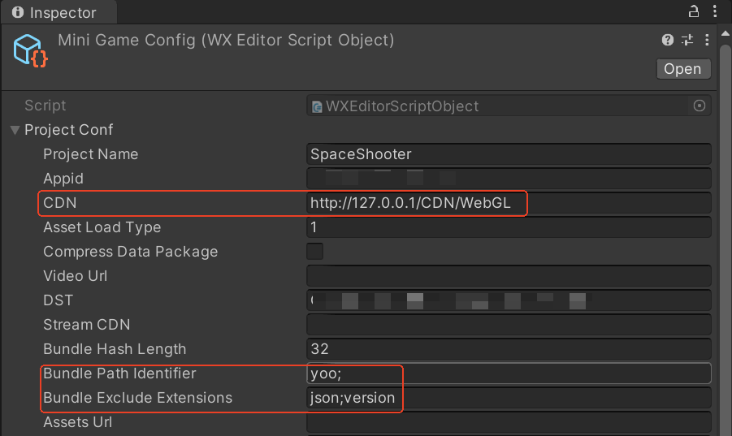
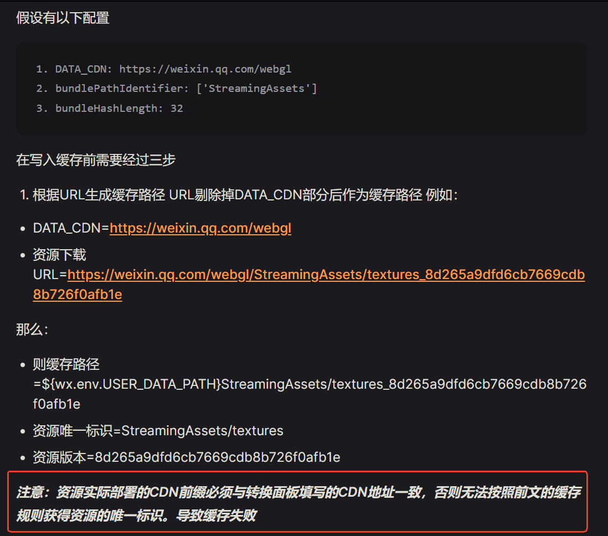
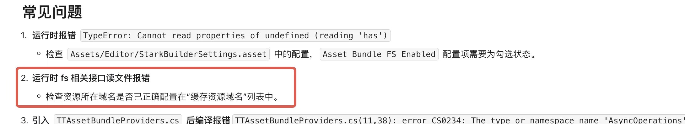

# 小游戏方案

了解如何使用YooAsset接入小游戏平台。

### 网页小游戏

**文件系统注意事项**

1. 不支持同步加载。
2. 不支持原生文件构建管线。
3. 不支持下载器。

**文件系统初始化**

````csharp
IEnumerator InitPackage()
{
    // 创建远程服务类
    string defaultHostServer = GetHostServerURL();
    string fallbackHostServer = GetHostServerURL();
    var remoteServices = new RemoteServices(defaultHostServer, fallbackHostServer);
    
    // 创建解密服务类
    var decryptionServices = new WebDecryption();
    
    // 创建初始化参数
    var createParameters = new WebPlayModeParameters();
    createParameters.WebRemoteFileSystemParameters = FileSystemParameters.CreateDefaultWebRemoteFileSystemParameters(remoteServices, decryptionServices);
    createParameters.WebServerFileSystemParameters = FileSystemParameters.CreateDefaultWebServerFileSystemParameters(decryptionServices);
    
    // 初始化ResourcePackage
    yield reurn package.InitializeAsync(createParameters);
}
````


### 微信小游戏

首先安装WX-WASM-SDK-V2 Unity插件，然后导入微信文件系统相关代码。

微信文件系统相关代码在扩展工程内：Mini Game --> Runtime --> [WechatFileSystem](https://github.com/tuyoogame/YooAsset/tree/dev/Assets/YooAsset/Samples~/Extension%20Sample/Runtime/ExtensionFileSystem/WechatFileSystem)

**文件系统注意事项**

1. 不支持同步加载。
2. ~~不支持资源加密~~。（v2.2.12版本开始支持加密！）
3. 不支持原生文件构建管线。
4. 构建的Bundle文件名称不要带有中文！

**原生文件解决办法**

1. 修改Unity引擎无法识别的文件的后缀名为.bytes。
2. 视频文件通过微信插件来加载播放，视频文件不做资源版本控制。

**其它注意事项**

- 一定要禁止对资源清单版本文件进行缓存（文件名称样例：yourPackageName.version）
- URL地址里不要包含双反斜杠，例如：www.cdn.com/v1.0/android//xxx.bundle 双反斜杠会导致微信插件加载文件失败，但网络请求又不返回失败！

**文件系统初始化**

````csharp
IEnumerator InitPackage()
{
    // 创建远程服务类
    string defaultHostServer = GetHostServerURL();
    string fallbackHostServer = GetHostServerURL();
    var remoteServices = new RemoteServices(defaultHostServer, fallbackHostServer);
    
    // 创建解密服务类
    var decryptionServices = new WebDecryption();
    
    // 小游戏缓存根目录
    // 注意：此处代码根据微信插件配置来填写！
    string packageRoot = $"{WeChatWASM.WX.env.USER_DATA_PATH}/__GAME_FILE_CACHE/yoo";
    //string pacakgeRoot = $"{WeChatWASM.WX.PluginCachePath}/yoo";
    
    // 创建初始化参数
    var createParameters = new WebPlayModeParameters();
    createParameters.WebServerFileSystemParameters = WechatFileSystemCreater.CreateFileSystemParameters(packageRoot, remoteServices, decryptionServices);
    
    // 初始化ResourcePackage
    yield reurn package.InitializeAsync(createParameters);
}

// 解密服务类
private class WebDecryption : IWebDecryptionServices
{
    public WebDecryptResult LoadAssetBundle(WebDecryptFileInfo fileInfo)
    {
        // 安全起见可以拷贝一份原始数据
        byte[] copyData = new byte[fileInfo.FileData.Length];
        Buffer.BlockCopy(fileInfo.FileData, 0, copyData, 0, fileInfo.FileData.Length);

        // 实现你的解密算法
        for (int i = 0; i < copyData.Length; i++)
        {
            ......
        }

        // 从内存中加载AssetBundle
        WebDecryptResult decryptResult = new WebDecryptResult();
        decryptResult.Result = AssetBundle.LoadFromMemory(copyData);
        return decryptResult;
    }
}
````

**微信插件配置**

假设CDN地址为：http://127.0.0.1/CDN/WebGL/yoo/ (该目录下存储的是热更文件)

根据下图配置，则初始化代码PackageRoot设置为

注意：如果缓存总是失败，可以尝试把yoo替换为StreamingAssets

```csharp
string packageRoot = $"{WeChatWASM.WX.env.USER_DATA_PATH}/__GAME_FILE_CACHE/yoo"
//string pacakgeRoot = $"{WeChatWASM.WX.PluginCachePath}/yoo";
```



**参考教程**

微信官方文档：https://wechat-miniprogram.github.io/minigame-unity-webgl-transform/Design/FileCache.html



### 抖音小游戏

首先安装字节小游戏相关的Unity插件，然后导入抖音文件系统相关代码。

抖音文件系统相关代码在扩展工程内：Mini Game --> Runtime --> [TiktokFileSystem](https://github.com/tuyoogame/YooAsset/tree/dev/Assets/YooAsset/Samples~/Extension%20Sample/Runtime/ExtensionFileSystem/TiktokFileSystem)

**文件系统注意事项**

1. 不支持同步加载。
2. ~~不支持资源加密~~。（v2.2.12版本开始支持加密！）
3. 不支持原生文件构建管线。

**原生文件解决办法**

1. 修改Unity引擎无法识别的文件的后缀名为.bytes。
2. 视频文件通过抖音插件来加载播放，视频文件不做资源版本控制。

**文件系统初始化**

````csharp
IEnumerator InitPackage()
{
    // 创建远程服务类
    string defaultHostServer = GetHostServerURL();
    string fallbackHostServer = GetHostServerURL();
    var remoteServices = new RemoteServices(defaultHostServer, fallbackHostServer);
    
    // 创建解密服务类
    var decryptionServices = new WebDecryption();
    
    // 小游戏缓存根目录
    // 注意：如果有子目录，请修改此处！
    string packageRoot = $"xxx"; 
    
    // 创建初始化参数
    var createParameters = new WebPlayModeParameters();
    createParameters.WebServerFileSystemParameters = TiktokFileSystemCreater.CreateFileSystemParameters(packageRoot, remoteServices, decryptionServices);
    
    // 初始化ResourcePackage
    yield reurn package.InitializeAsync(createParameters);
}
````

**其它注意事项**

- 一定要禁止对资源清单版本文件进行缓存（文件名称样例：yourPackageName.version）




### 支付宝小游戏

由于官方在文件系统层面支持不足，[官方文档介绍](https://opendocs.alipay.com/mini-game/0ftleg)

目前的技术方案走WebGL网页平台的文件系统。

**文件系统注意事项**

1. 不支持同步加载。
2. ~~不支持资源加密~~。（v2.2.12版本开始支持加密！）
3. 不支持原生文件构建管线。

**文件系统初始化**

```csharp
IEnumerator InitPackage()
{
    // 创建远程服务类
    string defaultHostServer = GetHostServerURL();
    string fallbackHostServer = GetHostServerURL();
    var remoteServices = new RemoteServices(defaultHostServer, fallbackHostServer);
    
    // 创建解密服务类
    var decryptionServices = new WebDecryption();
    
    // 创建初始化参数
    bool disableUnityWebCache = true; //注意：一定要禁用引擎的缓存机制！！！
    var createParameters = new WebPlayModeParameters();
    createParameters.WebRemoteFileSystemParameters = FileSystemParameters.CreateDefaultWebRemoteFileSystemParameters(remoteServices, decryptionServices, disableUnityWebCache);
    
    // 初始化ResourcePackage
    yield reurn package.InitializeAsync(createParameters);
}
```


### 关于支持同步加载的折中方案

因为WebGL平台的特殊性，无法支持同步加载方法，只能走边玩边下的方式（全部实现异步加载）。

但对于已经上线的项目，在功能业务逻辑里会存在大量的同步加载。要适配微信小游戏平台，要修改大量的业务代码是十分痛苦的事情。

这里有一种折中方案，可以避免做大量的业务代码调整。

方案核心思路就是提前用异步方法加载AssetBundle，并让其驻留在内存中，然后业务层就可以用同步方法去加载其中的资源对象。

```csharp
private RawFileHandle _bundleHandle;
private AssetHandle _assetHandle;

private IEnumerator Start()
{
    // 异步加载并持有AssetBundle的句柄
    _bundleHandle = package.LoadRawFileAsync("prefab_location");
    yield return _bundleHandle;
    
    // 调用游戏逻辑
    GameLogic();
}

private void OnDestroy()
{
    // 合适的时机释放句柄，防止资源泄露
    _bundleHandle.Release();
    _assetHandle.Release();
}

private void GameLogic()
{
    // 业务代码可以用同步加载方法
    var assetHandle = package.LoadAssetSync("prefab_location");
    var go = assetHandle.InstantiateSync();
}
```

