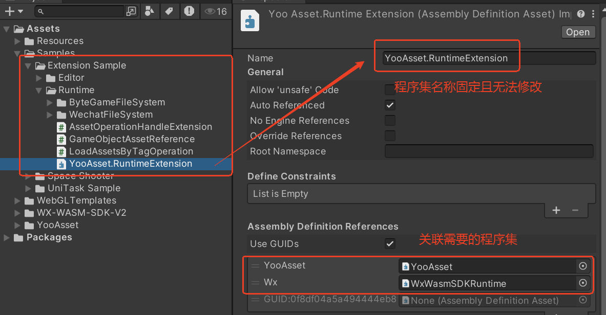

# 解决方案

了解一些常规的解决方案。

### 如何扩展文件系统类

YooAsset提供了一个可扩展的文件系统接口（IFileSystem接口）。

业务层可以通过继承并实现该接口，来实现定制化的文件系统类，满足项目的各类需求。

YooAsset的内部类型和接口全部做了internal修饰符，要想访问或者继承这些类或接口，需要将代码放置到特定的程序集下。

可以直接导入Sample工程到本地开发工程里。



### 分布式构建解决方案

对于一些超大项目，一般会采取美术工程和游戏工程分开的方案。

通过使用YooAsset的Package机制，可以完美适配该方案。可以把Package理解为一个独立的资源包裹，每个Package之间不存在互相依赖的资源，都是互相独立的沙盒。

**美术工程**

该工程内包含关卡场景，3D模型，粒子特效，着色器等资源，创建名为GameArt的Package收集器。

注意：美术工程在修改完毕后，可以通过自动化工具来打包，然后上传到公司本地的资源服务器。

**游戏工程**

该工程内包含逻辑代码，UI图集，UI面板，UI字体，音频等资源，创建名为GameLogic的Package收集器。

注意：游戏工程里不要使用美术工程里的着色器，避免造成冗余！

```csharp
// 以下是项目开发阶段的解决方案
private IEnumerator Start()
{
    // 游戏工程使用编辑器模拟运行方式，可以方便快捷的验证游戏修改效果。
    {
        var package = YooAssets.CreatePackage("GameLogic");
        var initParameters = new EditorSimulateModeParameters();
        ...（省略初始化参数）
        var initializationOperation = package.InitializeAsync(initParameters);
        yield return initializationOperation;        
    }

    // 美术工程使用HostPlayMode运行方式，通过公司本地的资源服务器来更新。
    {
        var package = YooAssets.CreatePackage("GameArt");
        var initParameters = new HostPlayModeParameters();
        ...（省略初始化参数）
        var initOperation = package.InitializeAsync(initParameters);       
        initializationOperation = package.InitializeAsync(createParameters);
        yield return initializationOperation;  
        
        //美术资源更新流程
        ......
    }
}
```

### 本地资源拷贝定制解决方案

在安卓平台加载包体内的加密文件或原生文件，会先把文件拷贝到沙盒内在做后续处理。

如果使用同步方法加载资源，默认的文件系统会通过UnityWebRequest类去下载内置文件到沙盒目录下。

因为涉及同步行为，代码里会使用While循环内部监测下载行为，直到下载结束，期间会挂起主线程。

目前发现团结引擎发布的安卓程序在某些机型里会出现偶现卡死的现象[issue:585](https://github.com/tuyoogame/YooAsset/issues/585)，为了规避这个问题，YOO提供了本地文件拷贝服务类接口。

```csharp
/// <summary>
/// 本地文件拷贝服务类
/// </summary>
public interface ICopyLocalFileServices
{
    void CopyFile(LocalFileInfo sourceFileInfo, string destFilePath);
}
```

本地文件拷贝服务类的扩展示例

注意：包体内文件拷贝，沙盒内文件导入都会触发该服务！

```csharp
using System;
using System.IO;
using YooAsset;

public class CopyLocalFileServices : ICopyLocalFileServices
{
    private class AndroidWrapper
    {
        public static void CopyAssetFile(string assetPath, string destPath)
        {
            // 注意：请实现安卓平台拷贝内置文件的原生接口
            ......
        }
    }

    public void CopyFile(LocalFileInfo sourceFileInfo, string destFilePath)
    {
#if UNITY_ANDROID
    	// 安卓平台包体内文件的拷贝走安卓原生方法
        if (IsBuildinSourceFile(sourceFileInfo.SourceFileURL))
        {
            // SourceFileURL示例 jar:file:///apk_path!/assets/yoo/DefaultPackage/xxxxxx.bundle
            AndroidWrapper.CopyAssetFile(sourceFileInfo.SourceFileURL, destFilePath);
        }
        else
        {
            string sourceFilePath = ConvertFileUriToPath(sourceFileInfo.SourceFileURL);
            File.Copy(sourceFilePath, destFilePath);
        }
#else
    	// 其它平台本地文件拷贝走正常方法
        string sourceFilePath = ConvertFileUriToPath(sourceFileInfo.SourceFileURL);
        File.Copy(sourceFilePath, destFilePath);
#endif
    }

    // 检测本地文件URL地址是否为安卓内包体文件
    private bool IsBuildinSourceFile(string fileURL)
    {
        if (string.IsNullOrEmpty(fileURL))
            return false;

        // 判断是否包含APK路径特征
        return fileURL.StartsWith("jar:file://", StringComparison.OrdinalIgnoreCase) && fileURL.Contains("!/assets/");
    }

    // 本地文件URL地址转换为标准文件路径
    public static string ConvertFileUriToPath(string uri)
    {
        if (string.IsNullOrEmpty(uri))
            return uri;

        // 处理标准 file:// URL
        if (uri.StartsWith("file://", StringComparison.Ordinal))
        {
            // 去除 file:// 前缀
            string path = uri.Substring(7);

            // 处理 Android 特殊格式 (file:/// 后跟绝对路径)
            if (path.StartsWith("//"))
                return path.Substring(1);
            else
                return path;
        }

        return uri;
    }
}
```

### 资源自定义分发解决方案

希望将所有热更资源压缩到一个ZIP包里。玩家第一次启动游戏去下载ZIP包，下载完成后解压到沙盒目录下。

文件系统实现过程注意事项：

1. ZIP包的下载和解压可以安排在初始化流程里。
2. ZIP包的下载和解压只保证发生一次。
3. ZIP包的下载器需要满足断点续传和文件校验逻辑。
4. 所有工作准备完毕后，通过文件导入器导入解压的资源文件。
5. 在导入完成后，可以将解压文件全部删除。

```csharp
/// <summary>
/// 创建资源导入器
/// 注意：资源文件名称必须和资源服务器部署的文件名称一致！
/// </summary>
/// <param name="filePaths">资源路径列表</param>
/// <param name="importerMaxNumber">同时导入的最大文件数</param>
/// <param name="failedTryAgain">导入失败的重试次数</param>
public ResourceImporterOperation CreateResourceImporter(string[] filePaths, int importerMaxNumber, int failedTryAgain)
```

### 首包资源定制解决方案

YooAsset默认支持通过Tag来指定首包资源，开发者也可以灵活定制自己的首包方案。

例如：在编辑器下，运行游戏过程中记录YooAsset加载过的资源对象，然后将这些资源对象依赖的AssetBundle文件拷贝到StreamgAssets目录下作为首包内容。

```csharp
using UnityEngine;
using UnityEditor;
using YooAsset.Editor;

void BuildBundle()
{
    // 等待资源构建流程完成
    ......
    
    // 加载构建成功的资源清单对象
    byte[] manifestBytes = FileUtility.ReadAllBytes(manifestPath);
    PackageManifest manifest = ManifestTools.DeserializeFromBinary(manifestBytes);
    
    // 查找所有需要打进首包资源的依赖AB
    HashSet<PackageBundle> bundles = new HashSet<PackageBundle>();
    foreach(var assetPath in buildinAssetPathList)
    {
        if(manifest.TryGetPackageAsset(assetPath, out PackageAsset packageAsset))
        {
            var packageBundle = manifest.BundleList[packageAsset.BundleID];
            if(bundles.Contains(packageBundle) == false)
                bundles.Add(packageBundle);
        }
    }
    
    // 拷贝所有首包文件
    string root = $"{AssetBundleBuilderHelper.GetDefaultStreamingAssetsRoot()}/{packageName}";
    foreach(var packageBundle in bundles)
    {
        string destPath = $"{root}/{packageBundle.FileName}";
        ...... //拷贝文件
    }
}
```

### 视频打包和加载解决方案

在AssetBundleCollector界面对视频文件使用PackVideoFile打包规则。

然后使用原生文件构建管线构建资源包。

```csharp
// 初始化文件系统注意事项
// 注意：开启APPEND_FILE_EXTENSION参数
public IEnumerator Start()
{
    var buildinFileSystemParams = FileSystemParameters.CreateDefaultBuildinFileSystemParameters();
    buildinFileSystemParams.AddParameter(FileSystemParametersDefine.APPEND_FILE_EXTENSION, true);
    
    var cacheFileSystemParams = FileSystemParameters.CreateDefaultCacheFileSystemParameters(remoteServices);
    cacheFileSystemParams.AddParameter(FileSystemParametersDefine.APPEND_FILE_EXTENSION, true);
    
    var createParameters = new HostPlayModeParameters();
    createParameters.BuildinFileSystemParameters = buildinFileSystemParams;
    createParameters.CacheFileSystemParameters = cacheFileSystemParams;
    initializationOperation = package.InitializeAsync(createParameters);
    yield return initializationOperation;
}
```

```csharp
// 视频加载范例
// 注意：使用原生文件加载方法
public IEnumerator Start()
{
    var package = YooAssets.GetPackage("DefaultPackage");
    var handle = package.LoadRawFileAsync(location);
    yield return handle;
    
    _videoPlayer.url = handle.GetRawFilePath();
    _videoPlayer.Play();
}
```

### 图集打包的零冗余解决方案

在unity2020以上的版本，我们会推荐使用SBP构建管线。

在使用Unity的图集系统的时候（SpriteAtlas），如何解决通过SBP构建管线造成的散图冗余的问题。

1. 确保SBP插件的版本升级到最新（例如：v1.21.25）。
3. 确保精灵散图的收集器设置为StaticAssetCollector类型。

```csharp
// 图集加载范例
public IEnumerator Start()
{
    var package = YooAssets.GetPackage("DefaultPackage");
    var handle = package.LoadAssetAsync<SpriteAtlas>(location);
    yield return handle;
    
    var atlas = handle.AssetObject as SpriteAtlas;
    _image.sprite = atlas.GetSprite("icon_test");
}
```

### 图集丢失变白块的解决方案

在使用YooAsset2.3x版本的时候，会遇到运行时精灵图片变白块的问题。

这是因为Bundle文件的依赖加载是以资源对象的实际依赖为准，如果面板未显示对SpriteAtlas图集建立引用关系，那么在运行时会遇到白块问题。

1. 首先确保SpriteAtlas检视面板勾选了Include In Build选项。

2. 运行时动态加载图集的Bundle文件（方案1）。

   完整代码请参考：[Extension Sample/Runtime/SpriteAtlasLoader](https://github.com/tuyoogame/YooAsset/blob/dev/Assets/YooAsset/Samples~/Extension%20Sample/Runtime/SpriteAtlasLoader)目录脚本！

   ```csharp
   // 方案1可选
   public class SpriteAtlasLoader : MonoBehaviour
   {
       public void Awake()
       {
           SpriteAtlasManager.atlasRequested += RequestAtlas;
       }
       private void RequestAtlas(string atlasName, Action<SpriteAtlas> callback)
       {
           var package = YooAssets.GetPackage("DefaultPackage");
           var loadHandle = package.LoadAssetSync<SpriteAtlas>(atlasName);
           callback.Invoke(loadHandle.AssetObject as SpriteAtlas);
       }
   }
   ```

3. 编辑器下显示添加图集依赖（方案2）。

   完整代码请参考：[Extension Sample/Runtime/PanelMonitor](https://github.com/tuyoogame/YooAsset/blob/dev/Assets/YooAsset/Samples~/Extension%20Sample/Runtime/PanelMonitor)目录脚本！

   **注意** : 在导入相关脚本后，需要配置相关文件夹的GUID，可以在对应的meta文件里获取！

   ```csharp
       /// <summary>
       /// 面板文件夹GUID
       /// </summary>
       private const string UIPanelDirectoryGUID = "12d33f33f3a55224c9c747d7bffa1c68";
   
       /// <summary>
       /// 精灵文件夹GUID
       /// </summary>
       private const string UISpriteDirectoryGUID = "935d7f20c085cc141a3daf9cacfabfae";
   
       /// <summary>
       /// 图集文件夹GUID
       /// </summary>
       private const string UIAtlasDirectoryGUID = "c355c783476322b4cacac98c5e1b46d8";
   ```

   ```csharp
   // 方案2可选
   public class PanelManifest : MonoBehaviour
   {
   	/// <summary>
   	/// 面板自动引用的图集
   	/// </summary>
   	public List<SpriteAtlas> ReferencesAtlas = new List<SpriteAtlas>();
   }
   public class UIPanelMonitor : UnityEditor.Editor
   {
       [InitializeOnLoadMethod]
       static void StartInitializeOnLoadMethod()
       {
           PrefabStage.prefabSaving += OnPrefabSaving;
       }
       static void OnPrefabSaving(GameObject go)
       {
           // 扫描预制体所有Image组件，找到对应的图集对象并建立引用关系
           ......
       }
   }
   ```

### 弱联网环境解决方案

对于偏单机但是也有资源热更需求的项目。当玩家在无网络的时候，我们又不希望玩家卡在资源更新步骤而不能正常游戏。所以当玩家本地网络有问题的时候，我们可以跳过资源更新的步骤。

````csharp
private IEnumerator Start()
{
    var package = YooAssets.CreatePackage("DefaultPackage");
    
    // 初始化注意事项
    // 注意：设置参数COPY_BUILDIN_PACKAGE_MANIFEST，可以初始化的时候拷贝内置清单到沙盒目录
    var buildinFileSystemParams = FileSystemParameters.CreateDefaultBuildinFileSystemParameters();
    buildinFileSystemParams.AddParameter(FileSystemParametersDefine.COPY_BUILDIN_PACKAGE_MANIFEST, true);
    
    // 注意：设置参数INSTALL_CLEAR_MODE，可以解决覆盖安装的时候将拷贝的内置清单文件清理的问题。
    var cacheFileSystemParams = FileSystemParameters.CreateDefaultCacheFileSystemParameters(remoteServices); 
    cacheFileSystemParams.AddParameter(FileSystemParametersDefine.INSTALL_CLEAR_MODE, EOverwriteInstallClearMode.None);
    
    var playModeParameters = new HostPlayModeParameters();
    playModeParameters.BuildinFileSystemParameters = buildinFileSystemParams;
    playModeParameters.CacheFileSystemParameters = cacheFileSystemParams;
    var initOperation = package.InitializeAsync(playModeParameters);
    yield return initOperation;
    
    // 先获取远端最新的资源版本
    var versionOp = package.RequestPackageVersionAsync(30);
    yield return versionOp;
    if (versionOp.Status == EOperationStatus.Succeed)
    {
        // 如果获取远端资源版本成功，说明当前网络连接通畅，可以走正常更新流程。
        var manifestOp = package.UpdatePackageManifestAsync(versionOp.PackageVersion);
		yield return manifestOp;
        if (manifestOp.Status != EOperationStatus.Succeed)
        {
            ShowMessageBox("请检查本地网络，资源清单更新失败！");
            yield break;
        }
        
        // 创建下载器并更新资源
        ......（代码省略）
        
        // 注意：下载完成之后再保存本地版本
        PlayerPrefs.SetString("GAME_VERSION", versionOp.PackageVersion);
        
        // 开始游戏
        StartGame();
    }
    else
    {
        // 获取上次成功记录的版本
        string version = PlayerPrefs.GetString("GAME_VERSION", string.Empty);
        if(string.IsNullOrEmpty(version))
        {
            ShowMessageBox("没有找到本地版本记录，需要更新资源！");
            yield break;
        }
        
        // 加载本地缓存的资源清单文件
        var manifestOp = package.UpdatePackageManifestAsync(version);
		yield return manifestOp;
        if (manifestOp.Status != EOperationStatus.Succeed)
        {
            ShowMessageBox("加载本地资源清单文件失败，需要更新资源！");
            yield break;
        }
        
        // 在正常开始游戏之前，还需要验证本地清单内容的完整性。
        var downloader = package.CreateResourceDownloader(1, 1, 60);
        if (downloader.TotalDownloadCount > 0)   
        {
            ShowMessageBox("资源内容本地并不完整，需要更新资源！");
            yield break;
        }
        
        // 开始游戏
        StartGame();
    }
}
````

### 资源服务器自定义请求解决方案

例如：在HTTP请求里增加账号密码等内容。

```csharp
// 设置自定义请求委托
YooAssets.SetDownloadSystemUnityWebRequest(MyWebRequester);

public UnityWebRequest MyWebRequester(string url)
{
    var request = new UnityWebRequest(url, UnityWebRequest.kHttpVerbGET);
    var authorization = GetAuthorization("Admin", "12345");
    request.SetRequestHeader("AUTHORIZATION", authorization);
    return request;
}
private string GetAuthorization(string userName, string password)
{
    string auth = userName + ":" + password;
    var bytes = System.Text.Encoding.GetEncoding("ISO-8859-1").GetBytes(auth);
    return "Basic " + System.Convert.ToBase64String(bytes);
}
```

### Steam平台支持DLC扩展资源方案

在Steam官方平台下载DLC资产，然后解压到游戏目录下（通常是内置资产所在目录）。

**注意**：2.3.6版本开始，内置文件系统的Catalog文件现在存储在StreammingAssets目录下。

**注意**：2.3.6版本之前，内置文件系统的Catalog文件存储在Resources目录下，和APP绑定在一起无法更新。

在构建资源的时候CopyBuildinFileOption为ClearAndCopyAll。这样在内置文件输出目录下会自动生成Catalog文件，可以将该Catalog文件和资源文件一起做DLC分发。

另外一个方案就是禁用内置文件系统的Catalog文件用于内置文件的查询。在禁用catalog文件后，所有资源文件的加载会全部从内置文件里读取并加载，该方案并不适用HostPlayMode！

```csharp
// 禁用Catalog文件！
// 说明：Catalog文件是自动生成的内置资产查询目录文件，用于记录构建APP时刻包体内的资产列表。
public IEnumerator Start()
{
    var buildinFileSystemParams = FileSystemParameters.CreateDefaultBuildinFileSystemParameters();
    buildinFileSystemParams.AddParameter(FileSystemParametersDefine.DISABLE_CATALOG_FILE, true);
    
    var createParameters = new OfflinePlayModeParameters();
    createParameters.BuildinFileSystemParameters = buildinFileSystemParams;
    initializationOperation = package.InitializeAsync(createParameters);
    yield return initializationOperation;
}
```

### FairyGUI支持解决方案

注意：在FairyGUI的面板销毁的时候，将资源句柄列表释放，否则会造成资源泄漏。

````csharp
// 资源句柄列表
private List<AssetOperationHandle> _handles = new List<AssetOperationHandle>(100);

// 加载方法
private object LoadFunc(string name, string extension, System.Type type, out DestroyMethod method)
{
    method = DestroyMethod.None; //注意：这里一定要设置为None
    string location = $"Assets/FairyRes/{name}{extension}";
    var package = YooAssets.GetPackage("DefaultPackage");
    var handle = package.LoadAssetSync(location , type);
    _handles.Add(handle);
    return handle.AssetObject;
}

// 执行FairyGUI的添加包函数
UIPackage.AddPackage(name, LoadFunc);

// 释放资源句柄列表
private void ReleaseHandles()
{
    foreach(var handle in _handles)
    {
        handle.Release();
    }
    _handles.Clear();
}
````

### Wwise音频热更解决方案

Wwise在iOS和Android平台，提供了API用于设置SoundBank路径。

AkSoundEngine::SetBasePath()设置基础目录。

```
SetBasePath的默认路径为：Application.streamingAssetsPath/Audio/GeneratedSoundBanks/(Platform)
```

AkSoundEngine::AddBasePath()设置热更目录，该方法可以设置多个更新目录。

```
AddBasePath的默认路径为：Application.persistentDataPath
```

**加载规则**

LoadBank时会从最后一次AddBasePath的路径开始搜索，依次向前最后到SetBasePath的路径，搜索到第一个目标SoundBank后加载。

**伪代码示例**

```csharp
// 在资源收集界面，将SoundBank文件目录设置为原生文件（PackRawFile)，并增加一个Tag标记。
public IEnumerator Start()
{
    ......
        
    var package = YooAssets.GetPackage("DefaultPackage");
    
    // 通过Tag标记下载更新的音频文件
    var downloader = package.CreateResourceDownloader(soundbankTag);
    downloader.BeginDownload();
 	yield return downloader;
    
    // 通过下面的方法获取原生文件的句柄
    var handle = package.LoadRawFileAsync(location);
    yield return handle;
    
    // 拷贝沙盒内音频文件到指定目录下（AddBasePath方法添加的目录）
    var packageVersion = package.GetPackageVersion();
    var basePath = $"{Application.persistentDataPath}/Audio/GeneratedSoundBanks/{packageVersion}";
    var soundbankSourceFilePath = handle.GetRawFilePath();
    var soundbankDestFilePath = $"{basePath}/soundbankFileName";
    if (File.Exists(soundbankDestFilePath) == false)
    {
        File.Copy(soundbankSourceFilePath, soundbankDestFilePath);
    }
}
```

参考：https://zhuanlan.zhihu.com/p/32055700/

### UniTask支持解决方案

详情参考 [UniTask 配置教程](https://github.com/tuyoogame/YooAsset/tree/main/Assets/YooAsset/Samples~/UniTask%20Sample/README.md)
